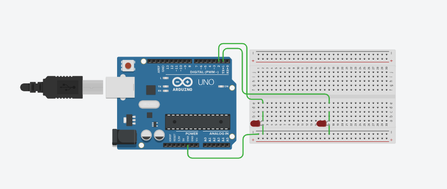

## 🤖 Finger-Controlled LED System with ESP8266 & OpenCV
## 📌 Project Description
This project is an LED light control system using real-time finger detection via a laptop camera/webcam. The system utilizes OpenCV and MediaPipe for image processing, and the ESP8266 to control two LED lights.
- If 2 or 5 fingers are detected, the LED lights up.
- If anything else (0, 1, 3, or 4 fingers are detected), the LED turns off.

## 🛠️ Tools & Materials
- ESP8266 (NodeMCU / Wemos D1 Mini)
- 2 LEDs
- Jumper wires
- Breadboard
- Resistors (220Ω for LEDs)
- Laptop/PC with camera

## 🔌 Circuit Diagram
1. Positive pole of LED 1 → pin D1
2. Positive pole of LED 2 → pin D2
3. Negative pole of both LEDs → GND ESP8266
4. Use a 220Ω series resistor to limit the LED current.

Schematic Diagram



## ▶️ How to Run
1. Upload the test.ino code to the ESP8266 using the Arduino IDE.
2. Install Dependencies
```bash
pip install opencv-python mediapipe pyserial
```
3. Run app.py in Python :
```bash
python app.py
```
4. Make sure the COM port in app.py matches the ESP8266 port.
5. Point your hand at the camera → the LED will turn on/off according to the number of fingers.

## 📷 Demo


## 📋 Uses in Daily Life (Descriptive)

This system is designed to provide a touchless electronic device control solution, which has many real-life benefits :
1. Touchless Light Control
- Useful in environments that require high hygiene, such as hospital operating rooms, laboratories, or kitchens.
- Reduces the risk of transmitting bacteria or viruses because there's no need to touch switches.
2. Accessibility Technology
- Helps people with disabilities or the elderly who have difficulty operating physical switches.
- Device control becomes easier with just hand gestures.
3. Smart Home & Home Automation
- Can be integrated with smart home systems to control lights, fans, automatic blinds, or other electronic devices touchlessly.
4. Technology Exhibitions & Education
- Great for display at technology exhibitions or as teaching materials in schools/universities.
- Teaching basic concepts of Computer Vision and IoT through real-world applications.
5. Modern Work Environment
- Can be used in offices, recording studios, or creative workspaces to control spotlights, audio equipment, or other devices without leaving your work position.

## 🚩Contributions
I would appreciate contributions to improve the model, add or enhance features, and optimize the deployment process. For any queries, reach out to me at joni150703@gmail.com

## 📄 License
This project is licensed under the MIT License.
Free to use, modify, and distribute.
